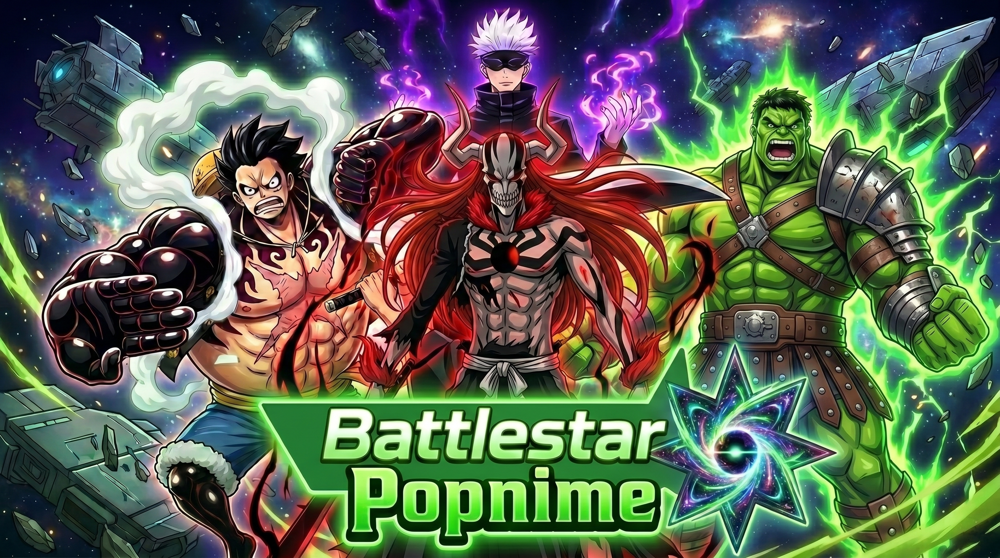
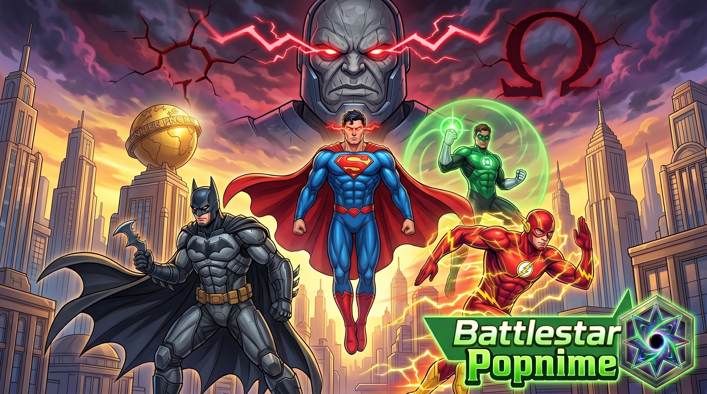

# 🌟 Battlestar Popnime

  

**Battlestar Popnime** é um web-game no estilo **Tower Defense** que reúne personagens icônicos de diversos universos de anime e quadrinhos (Naruto, Bleach, One Piece, Marvel, entre outros). O jogo conta com um sistema completo de progressão, incluindo **Gacha**, missões, inventário, evolução, prestígio e recursos online.

---

## 🚀 Como Jogar

> ⚠️ **Login obrigatório.** Battlestar Popnime é um jogo online — é necessário criar uma conta e estar conectado à internet para jogar. Não há modo offline.

### 🖥️ Instalador Desktop (Windows)

Baixe e instale o jogo diretamente na sua máquina:

**[⬇️ Download — Battlestar Popnime para Windows](https://github.com/ViniciusDevB/Battlestar-Popnime/releases/latest)**

- Abre como qualquer jogo — sem navegador, sem abas
- Recebe atualizações automáticas ao abrir o jogo
- Requer internet e login para jogar

### 🌐 Versão Web (Navegador)

Acesse diretamente pelo navegador, sem instalação:

**🔗 [viniciusdevb.github.io/Battlestar-Popnime](https://viniciusdevb.github.io/Battlestar-Popnime/)**

O progresso é sincronizado na nuvem — sua conta funciona nas duas versões.

---

## ✨ Funcionalidades

**Gameplay:**
- **Tower Defense Dinâmico** — posicione unidades estrategicamente. Cada personagem tem tipo de ataque único (Single, Linha, Cone, AOE, Pierce, Scatter), passivas e upgrades exclusivos.
- **Mundos e Fases** — 4 mundos temáticos (Naruto, One Piece, Bleach, Marvel) com progressão linear de HP ajustada. 6 fases cada, 10 waves por fase. Três dificuldades por fase (Normal, Difícil, Lendário).
- **♾ Modo Infinito** — waves sem fim com dificuldade escalável (8 tiers). Farm de Star Experience e Gemas. Limite de 3 cópias por unidade por partida.
- **Sagas de Eventos** — capítulos narrativos estendidos (10 a 15 waves) para maior farm de ouro, com modificadores únicos e personagens exclusivos.

**Progressão:**
- **Gacha ⚡** — invoque personagens (3⭐ a 5⭐) com pity garantido no 150º pull. Banners rotativos a cada 30 minutos com pool diferente.
- **Feed & Evolução 🔮** — suba de nível unidades via Feed e evolua-as para formas superiores com materiais dropados em fases.
- **Prestígio ✦** — ao atingir Lv50, transmute uma unidade para Prestígio (máx P10). Cada nível concede +20% de dano e +6% de alcance, além de passivas exclusivas.
- **Star Experience ✨** — materiais exclusivos do Modo Infinito (Nv1–5) com XP massivo, usáveis no Feed de qualquer personagem.

**Missões 📋**
- **Diárias** — 10 missões sorteadas por dia (resets automático à meia-noite), recompensas em Gemas e Tickets.
- **Conquistas** — 55 missões permanentes cobrindo todos os mundos, kills, dano, gacha, coleção de personagens, modo infinito e progressão.
- **Comunidade** — missão online coletiva com meta global, barra de progresso em tempo real e recompensa de personagem 5⭐ aleatório para quem contribuiu.

**Online:**
- **Contas e Perfil** — registro/login com username e senha. Barra de status online no HUD. Contas novas iniciam com 500 💎 e os 3 personagens 3⭐ do banner ativo.
- **Leaderboard e Rankings** — envio de scores (infinito e fases), ranking global paginado com destaque do próprio rank.
- **Trocas** — ofertas assíncronas de personagens entre jogadores com até 3 unidades, pedido opcional e expiração automática (7 dias).
- **Save Sync** — save automático na nuvem garantindo a segurança do seu progresso.

**Qualidade de Vida:**
- Auto-Place com 3 slots por fase (salva e recarrega posicionamento).
- Undo da última torre colocada (tecla `Z`).
- Filtro múltiplo no inventário (mundo, raridade).
- Preview de wave com ícones de tipos e alerta de miniboss/boss.
- Comparação de atributos no painel de upgrade.
- Barra de pity colorida.
- Atalhos de teclado para principais ações do jogo.

---

## 📈 Histórico de Updates

> ⚖️ **Procurando pelos detalhes de balanceamento?**
> Veja o nosso documento de [Patch Notes (Buffs e Nerfs)](./PATCH_NOTES.md) para acompanhar todas as mudanças específicas em personagens e mundos!

### 🔄 Update 3.1: Base de Operações e Relíquias *(Lançado)*

- **Base de Operações (Nexus)** — 10 estruturas melhoráveis com Gemas que persistem entre partidas. Hospital, Cofre, Academia, Torre de Vigilância, Forja de Relíquias, Quartel, Laboratório, Banco de Guerra, Templo dos Campeões e Centro de Retransmissão.
- **Sistema de Relíquias** — artefatos de 4★ e 5★ (um por mundo) com efeitos únicos e variante Corrompida de alto risco/retorno. Equipáveis em qualquer unidade do inventário; forjados com materiais dropados em fases.
- **Rebalanceamento de Prestígio** — unidades de dano: +10%/+2% dano por tier; unidades de farm: +2% ouro por wave por tier. Substituiu o bônus genérico anterior.
- **Segurança — Gacha Server-Side** — todo o sorteio, pity e dedução de moeda agora ocorre exclusivamente no servidor via RPC atômica. Nenhum dado econômico vem do cliente.
- **Segurança — Anti-Exploit de Trocas** — unidades em oferta ativa ficam bloqueadas: não podem ser usadas em Feed, Evolução ou Prestígio enquanto a troca estiver pendente.
- **Correções de Bugs** — recompensas de missões não causam mais perda de gemas em falhas de rede; passivas de área (`slow_aura`, `santen_kesshun`) throttled para eliminar custo de CPU excessivo por frame.

---

### 🔄 Update 3: Crise nas Infinitas Terras *(Em Desenvolvimento)*

  

- **Mundo 5 — Metrópolis Sitiada**: 6 novas fases sob a invasão de Apokolips, com Darkseid como Boss final de 2 fases.
- **Mecânica Viva**: eventos ambientais em tempo real alteram o campo durante as waves — destroços de arranha-céus caem e blackouts afetam o alcance das torres.
- **Caminhos que se Cruzam**: primeiro mundo com duas rotas independentes que se intersectam, criando zonas de cobertura dupla.
- **9 novos personagens** do universo DC: Flash, Batgirl, Aquaman, Batman, Lois Lane, Lanterna Verde, Superman, Shazam e Flash Reverso.

#### ↳ Lançamento Desktop
- **Instalador Windows**: o jogo agora pode ser instalado como um executável nativo — sem navegador, com atalho na área de trabalho.
- **Atualizações Automáticas**: novas versões são baixadas em segundo plano e aplicadas com um clique ao reiniciar.

#### ↳ Internacionalização Completa
- **Suporte completo a Inglês**: todo o texto visível do jogo traduzido ao selecionar EN — HUD, menus, toasts, online, leaderboard, trocas e missões.
- **~140 novas chaves de tradução** e suporte a tooltips via `data-i18n-title`.

#### ↳ Rebalanceamento Global
- **Nova Economia**: ouro por kill padronizado (50), ouro inicial 300, skip progressivo.
- **Rework de L (Death Note)**: transformado na principal unidade de farm econômico.
- **Nova Passiva — Nami**: "Tempestade Acumulada" a cada 8 ataques.
- **Buff Naruto Sage**: dano base 120 → 150.
- **Nerf Hawkeye**: cooldown aumentado para evitar superação de unidades 5⭐.

#### ↳ A Era do Online
- **Contas e Perfil**: registro/login por username, pacote de boas-vindas com 500 💎.
- **Leaderboard e Rankings**: ranking global com posição pessoal destacada.
- **Sistema de Trocas**: ofertas assíncronas de até 3 unidades, expiração em 7 dias.
- **Missões de Comunidade**: meta coletiva global com recompensa de personagem 5⭐.
- **Save Sync**: progresso salvo automaticamente na nuvem.

#### ↳ Segurança e Deploy
- **Deploy Público** via GitHub Pages.
- **Anti-Cheat e Banimento Automático**: múltiplas camadas de proteção para integridade do leaderboard.
- **Sistema de Admin**: identificação visual exclusiva para contas de desenvolvedores.

#### ↳ Gacha e Áudio
- **Animação Épica no Gacha**: portal mágico, warp speed, meteoro e onda de choque.
- **Áudio Contínuo**: música do menu sem reinício entre transições de tela.

---

### ✅ Update 2: Invasão Secreta *(Lançado)*

  

- **Mundo 4 — Nova York**: 6 novas fases com Thanos como Boss final.
- **8 novos personagens**: Homem-Aranha, Viúva Negra, Gavião Arqueiro, Pantera Negra, Thor, Hulk, Iron Man e World Breaker Hulk.
- **Evento — Operação: Ressurreição**: 4 capítulos narrativos com modificadores e inimigos temáticos.

### ✅ Update 1: Soul Society *(Lançado)*
- **Mundo 3 — Bleach**: 6 novas fases com Aizen como Boss final.
- **10 novos personagens** do universo Bleach.
- **Sistema de Prestígio ✦** e **♾ Modo Infinito**.

### ✅ Updates Anteriores
- **0.6:** Evento — A Anomalia de Konoha.
- **0.5:** Grand Line (Mundo 2).
- **0:** Fundação Ninja (Lançamento base).

---

## ⏳ Por Vir

### ☣️ Evento: Protocolo Nemesis — Última Resistência

Um modo de jogo temporário inspirado em **Resident Evil clássico**. Defenda Raccoon City contra ondas de infectados enquanto o **Nemesis caça ativamente suas torres**, com bomba-relógio e meta-progressão permanente desbloqueando a unidade 5⭐ exclusiva **Nemesis**.

### 🔜 Update 4: Marvel vs DC *(Planejado)*
Evento especial centrado no confronto entre os universos Marvel e DC.

---

## 👨‍💻 Créditos

Projeto criado e mantido por [ViniciusDevB](https://github.com/ViniciusDevB).
